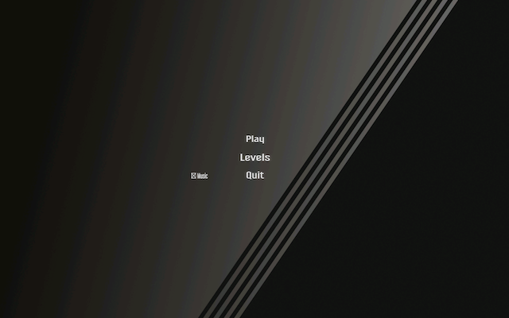
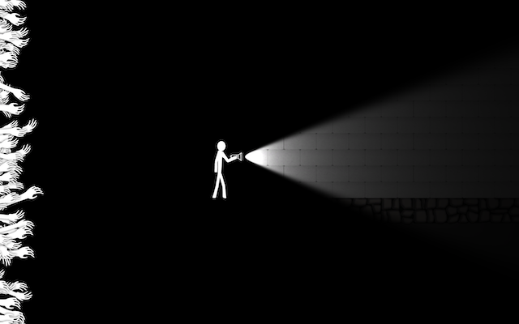

## The game
Into the light is a 2D platform game where the character has a flashlight and only the parts of the environment hit by the light are visible to the player. The goal is to complete the map while avoiding traps. The challenge is the fact that the whole map, aside from the objects hit by the light, is completely dark.

## Development
It was developed in a group of 6 students during a 4 week period using Scrum 
as framework for development. Non of us had previous experience with Unity.

## Demo
A demo (which is a bit buggy) of the game can be found in the repo of the group member [@djikoSal](https://github.com/djikoSal).

[Into The Light (Play in the browser)](https://djikosal.github.io/)

